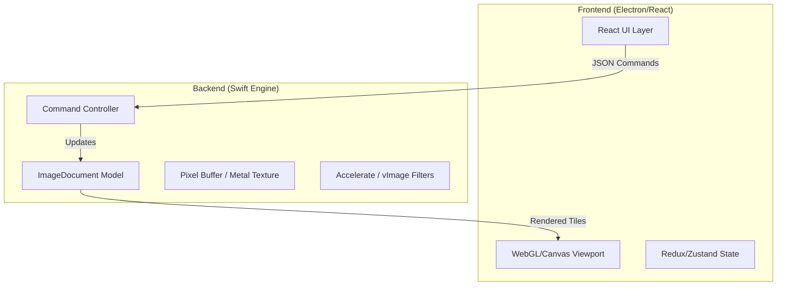

# Modernization Plan: Photoshop v1.0.1 to Apple Silicon (Swift/React/Electron)

## 1. Executive Summary
This plan outlines the re-architecture of the original Pascal/Assembly Photoshop source code into a modern hybrid application. 

*   **Frontend:** Electron & React. Provides the windowing system, menus, and tool palettes.
*   **Backend/Engine:** Swift (Native). Handles image buffers, file I/O, and pixel manipulation.
*   **Optimization Strategy:** Replace manual memory management and 68000 assembly with Swift's type safety, the **Accelerate framework (vImage)** for vectorization, and **Metal** for GPU compute.

## 2. Architecture Overview

We will separate the application into two distinct layers communicating via IPC (Inter-Process Communication) or FFI.

### Technology Stack Roles
*   **Electron:** Application shell, file system dialogs, cross-platform compatibility.
*   **React:** UI components (Toolbar, Layers panel, Menus).
*   **Swift:** The "Photoshop Engine".
    *   Replaces `UPhotoshop.p` (App Logic).
    *   Replaces `UVMemory.p` (Memory Management).
    *   Replaces `*.a` (Assembly) with `Accelerate` and `Metal`.

## 3. Implementation Phases

### Phase 1: Foundation & IPC
**Goal:** An empty Electron window that can talk to a Swift process.
1.  **Repo Setup:** Create a monorepo with `apps/electron` and `packages/engine-swift`.
2.  **Swift Setup:** Create a Swift Package executable that accepts JSON commands from stdin (or a local WebSocket).
3.  **IPC Bridge:** Create a TypeScript bridge in Electron to spawn the Swift process and send/receive messages.

### Phase 2: The Image Model (Replacing `UVMemory.p`)
**Goal:** Load an image into memory in Swift.
1.  **Memory Strategy:**
    *   *Legacy:* `TVMArray` manually swapped tiles to disk.
    *   *Modern:* Use `Data` or `UnsafeMutableRawPointer`. On Apple Silicon, we have Unified Memory. For massive files, use `mmap`.
2.  **Data Structure:** Create a `PixelBuffer` struct in Swift supporting RGBA 8-bit/16-bit/32-bit float.
3.  **File I/O:** Port basic file reading. Start with simple formats (PNG/TIFF via ImageIO) before porting the legacy parsers (`UPICTFile.p`, etc.).

### Phase 3: The Rendering Pipeline (Replacing `TImageView`)
**Goal:** Display the Swift image buffer in the React window.
1.  **Tile Generation:** The Swift engine divides the image into tiles (e.g., 256x256).
2.  **Transport:** Send tile data to Electron.
    *   *Option A:* Base64 strings over JSON (Slow, easy).
    *   *Option B:* Shared Memory / IOSurfaces (Fastest, Apple Silicon optimized).
3.  **Display:** React renders these tiles into an HTML5 `<canvas>` or WebGL context.

### Phase 4: Apple Silicon Optimization (Replacing `*.a`)
**Goal:** Reimplement core algorithms using Apple's hardware acceleration.
1.  **Analysis:** Identify assembly routines in `*.a` files (e.g., Rotation, Blending, Filters).
2.  **Implementation:**
    *   **vImage (Accelerate):** Use for standard convolutions (Blur, Sharpen) and arithmetic.
    *   **Metal:** Use for complex parallel tasks (Warping, custom filters).
3.  **Benchmark:** Compare Swift+Accelerate performance against baseline.

### Phase 5: Tools & Interaction (Replacing `TTool`)
**Goal:** Drawing pixels.
1.  **Input Handling:** React captures mouse events -> Sends coordinates to Swift.
2.  **Brush Engine:** Swift calculates the affected pixels.
    *   *Legacy:* `UDraw.p` calculated Bresenham lines pixel-by-pixel.
    *   *Modern:* Render brush tips onto the Metal texture or composite buffers using vImage.
3.  **Dirty Rects:** Swift tells React which part of the screen needs to redraw.

## 4. Component Mapping

| Legacy Component | Source File | Modern Replacement |
| :--- | :--- | :--- |
| `TPhotoshopApplication` | `MPhotoshop.p` | `Electron Main Process` |
| `TImageDocument` | `UPhotoshop.p` | `Swift ImageModel Class` |
| `TVMArray` | `UVMemory.p` | `Swift Data / Metal Texture` |
| `TImageView` | `UPhotoshop.p` | `React Canvas Component` |
| `TTool` (Enum) | `UPhotoshop.p` | `Redux State / Swift Command Pattern` |
| `Assembly Routines` | `*.a` | `Accelerate.framework (vImage)` |
| `Resources` | `*.r` | `React Components / CSS` |

## 5. Risk Assessment
1.  **Latency:** Ensure the round-trip from Mouse Move (React) -> Processing (Swift) -> Render (Canvas) is <16ms. Shared memory is critical here.
2.  **Complexity:** The original codebase has subtle behaviors in `UVMemory` that ensure stability. We must simplify this without causing memory leaks.

## 6. Next Steps (Immediate)
1.  Initialize the `electron-forge` project.
2.  Initialize the Swift executable package.
3.  Establish a "Ping-Pong" communication between them.
